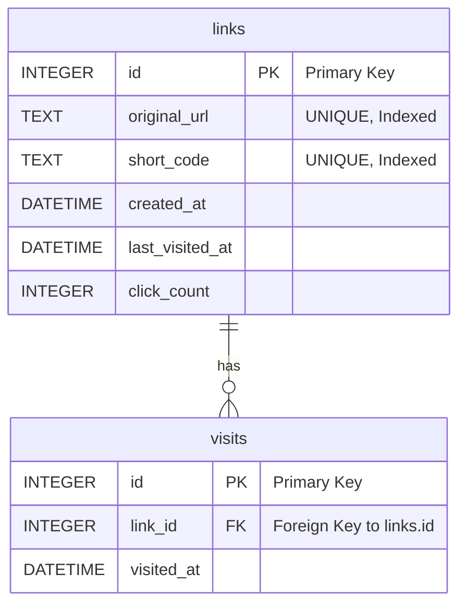

### Smart Link Shortener: Data Model

This document outlines a data model for the smart link shortener service, designed for use with an SQLite database. The model directly supports all specified features, including link creation, redirection, and analytics, while being structured for future extensibility.

---

### 1. Analysis and Assumptions

Before presenting the model, here are the key assumptions made during the analysis of your requirements:

* **No User Accounts:** The requirements do not mention user-specific links. Therefore, this model assumes all links are created anonymously and are publicly accessible. Adding user ownership would be a future extension, likely involving a `users` table and a foreign key in the `links` table.
* **Short Code Generation is Application Logic:** The data model is responsible for *storing* the unique short code, but the algorithm for *generating* it (e.g., base62 encoding of an ID, hashing) is considered part of the application logic (the FastAPI backend), not the database schema itself.
* **Analytics Extensibility:** The requirements state a need for basic analytics now (`click_count`, `last_clicked_at`) but also for an extensible backend. To satisfy both, the proposed model uses a hybrid approach:
    * It stores pre-aggregated analytics on the main `links` table for extremely fast lookups, satisfying the current API requirement.
    * It also stores every individual click event in a separate `visits` table. This provides a raw data source for more advanced analytics in the future (e.g., "clicks per day" charts) without requiring a schema change.

---

### 2. Proposed Data Model

The data model consists of two core tables: `links` and `visits`. This separation keeps the primary link information clean and allows for detailed, scalable tracking of click events.

#### Table: `links`

This table is the core of the system. It stores the fundamental relationship between an original URL and its shortened version, along with aggregated analytics for quick retrieval.

| Column Name       | Data Type (SQLite) | Constraints / Description                                                                                                                                              |
| :---------------- | :----------------- | :--------------------------------------------------------------------------------------------------------------------------------------------------------------------- |
| `id`              | `INTEGER`          | `PRIMARY KEY AUTOINCREMENT`. The unique identifier for each link record.                                                                                               |
| `original_url`    | `TEXT`             | `NOT NULL, UNIQUE`. The original, long URL. A `UNIQUE` constraint is crucial to prevent duplicate entries and return existing short links, as per the requirements. An index should be created on this column for fast lookups. |
| `short_code`      | `TEXT`             | `NOT NULL, UNIQUE`. The unique, human-readable code for the shortened URL (e.g., `aB3xY7`). An index is essential for fast lookups during redirection.                 |
| `created_at`      | `DATETIME`         | `NOT NULL, DEFAULT CURRENT_TIMESTAMP`. The timestamp of when the link was first created.                                                                               |
| `last_visited_at` | `DATETIME`         | `NULL`. The timestamp of the most recent click. It is `NULL` if the link has never been visited. Updated on every click.                                                  |
| `click_count`     | `INTEGER`          | `NOT NULL, DEFAULT 0`. A denormalized counter for the total number of clicks. This allows for very fast retrieval of the click count without needing to query the `visits` table. |

#### Table: `visits`

This table acts as a log, recording every single time a shortened link is used. This provides granular data for future analytics features.

| Column Name  | Data Type (SQLite) | Constraints / Description                                                  |
| :----------- | :----------------- | :------------------------------------------------------------------------- |
| `id`         | `INTEGER`          | `PRIMARY KEY AUTOINCREMENT`. The unique identifier for each visit event.   |
| `link_id`    | `INTEGER`          | `NOT NULL, FOREIGN KEY(links.id)`. A reference to the `id` of the link that was visited. An index should be created on this column. |
| `visited_at` | `DATETIME`         | `NOT NULL, DEFAULT CURRENT_TIMESTAMP`. The timestamp of the click event.   |

---

### 3. Relational Diagram (Mermaid)

This diagram illustrates the one-to-many relationship between the `links` and `visits` tables. One link can have many visits.

---

### 4. Verification and How the Model Meets Requirements

* **Accept a long URL and return a short URL:** The application would check if the `original_url` exists in the `links` table. If not, it generates a new `short_code` and inserts a new row.
* **Redirect a user:** The application looks up the `short_code` in the `links` table to find the `original_url`. This is efficient due to the `UNIQUE` index.
* **Track clicks:** When a redirect occurs, a new row is inserted into the `visits` table, and the `click_count` and `last_visited_at` columns in the corresponding `links` row are updated.
* **Provide analytics:** A `GET` request to an analytics endpoint can quickly retrieve `click_count` and `last_visited_at` directly from the `links` table using the `short_code`, ensuring a fast response.
* **Handle duplicate submissions:** The `UNIQUE` constraint on `links.original_url` ensures that if a URL is submitted again, the database will not allow a new entry. The application logic can catch this and return the existing `short_code`.
* **Handle non-existent links:** If a lookup by `short_code` in the `links` table returns no results, the application can correctly return the appropriate HTTP error code (e.g., 404 Not Found).
* **Extensibility:** By logging each click in the `visits` table, the system is ready for future features like "clicks in the last 24 hours" or "geolocation tracking" (by adding more columns to `visits`) without changing the core structure.
